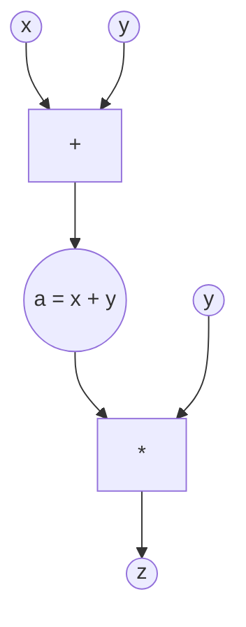

我好像对于autograd有了基本了解
首先 分为前向模式和反向模式
所以先讲前向模式

首先要有一个计算图的概念
当我们写下 z=(x+y)*y 这个算式(多元函数)




我们应该如何存储它?
一个非常自然而然的选择,树形结构
(但是注意,实际上是图结构,DAG有向无环图,因为在实际pytorch中没有两个y tensor,只有一个)

接下来,无论前向,反向,都是建立计算图基础之上

x,y都是叶子节点
运算符 都是中间节点
如果我们要计算$\frac{\partial z}{\partial x}$

所谓前向模式就是对计算图的所有节点计算对x偏导,
这点非常重要,注意是全部,这点非常有助于理解
前向模式中试图计算x的微分,就是在计算图中的对所有节点计算x的微分
(因此最终可以得到的$\frac{\partial z}{\partial x}$)
因为节点计算有着顺序要求(严谨的说是没有办法,只能从叶子节点开始计算),所有接下来能看到会先从xy开始计算,一步步走到z
这里总共有4个节点(y是被复用的)
注意 这4个节点中包括z,因此当完成全部的偏导计算后,咱们的结果自然就出来了
记 a=x+y 也就是那个+号节点是a


开始求导,假设我这里上来想求z,你会发现这是不可能的,我能看到的只有z=a*y ,但a和x的关系一无所知
因此我们要从叶子开始

\[
\frac{\partial x}{\partial x} = 1,\quad \frac{\partial y}{\partial x} = 0
\]

已知叶子节点的偏导后，可以沿计算图向前传播。对任意节点 \(v\)，若其依赖于输入 \(u_1, u_2, \dots\)，则有：

\[
\frac{\partial v}{\partial x}=
\sum_i
\frac{\partial v}{\partial u_i}
\cdot
\frac{\partial u_i}{\partial x}
\]

这就是链式法则在计算图中的形式(稍后我会解释为什么是这个样子)。


应用到具体节点：

\[
a = x + y \;\Rightarrow\;
\frac{\partial a}{\partial x}=
\frac{\partial x}{\partial x} +
\frac{\partial y}{\partial x}=
1 + 0 = 1
\]

\[
z = a \cdot y \;\Rightarrow\;
\frac{\partial z}{\partial x}=
\frac{\partial z}{\partial a} \cdot \frac{\partial a}{\partial x}+
\frac{\partial z}{\partial y} \cdot \frac{\partial y}{\partial x}
\]

\[=
y \cdot 1 + a \cdot 0=y
\]

这里只用最简单的加乘做例子
回顾一下,前向模式其实非常符合做题时处理导数的直觉
我们手动微分的时候,如果不化简,而是也用$a = x + y$的方式去代换,那么计算逻辑是完全一致的

所以我自己总结的前向模式概括非常简单粗暴:
前向模式就是对计算图的所有节点计算偏导

在这个计算过程中,不得已需要从叶子节点出发,一路向前到达根节点


代码也是非常简洁,我没有增加任何额外功能

```python
# forward
class Node:
    def __init__(self):
        self.left:Node=None
        self.right:Node=None
        self.op:str=None
        self.value:float=None
        self.dot:float=None
        pass

    def forward(self):
        if self.op is None:
            pass
        else:
            if self.op == "add":
                self.value=self.left.value+self.right.value
                self.dot= self.left.dot+self.right.dot
            if self.op == "mul":
                self.value=self.left.value*self.right.value
                self.dot= self.left.dot*self.right.value+self.left.value*self.right.dot
            

def test_forward():
    log.info("forward")
    x=Node()
    y=Node()
    a=Node()
    a.left=x
    a.right=y
    a.op="add"

    z=Node()
    z.left=a
    z.right=y
    z.op="mul"


    x.value=1.5
    x.dot=1.0
    y.value=-9.2
    y.dot=0.0

    a.forward()
    z.forward()
```

可以看到一个节点记录了:
1.自己的左右叶子节点是谁
2.自己的操作符是什么
3.自己的值是什么,
4.自己导数是什么

使用流程就是先定义计算图,接着给叶子节点赋值,然后按照顺序将中间节点逐个执行forward
forward中进行值计算与导数计算

注意1:在给叶子节点赋值的时候,也给叶子节点计算了偏导,这个计算是我手工给出,因为我对x求偏导,所以    x.dot=1.0,    y.dot=0.0 理所应当,但是如果我故意都设置成0.5呢?

注意2:现在完全是标量形式,实际pytorch中使用的是任意tensor,那该如何处理呢?

前向模式最大的问题是什么?
一次只能算一个结果,而梯度是所有偏导构成的向量,意味着如果我们想拿到梯度,需要将所有变量的前向模式全走一遍

有没有办法一次完成呢?
反向模式就是来解决这个问题的

当我们再次审视计算图
前向模式的"根本原理"是只要知道子节点的导数,我们就是可以计算父节点的导数
$$
z = a \cdot y \Rightarrow
\frac{\partial z}{\partial x}
= \frac{\partial a}{\partial x} \cdot y + a \cdot \frac{\partial y}{\partial x}
= y + (x + y)\cdot 0
= y
$$

在这个过程中,我们知道a和y,所以可以计算出z

那么反过来,其实如果我们知道父节点的导数,也能知道子节点的导数
反向模式的核心原理(帮助记忆)
就是对所有节点,计算z对当前节点的偏导
(那么自然而然的,计算到叶子节点的时候,我们就一次性得到的$\frac{\partial z}{\partial x}$, $\frac{\partial z}{\partial y}$)

但是这里有个关键问题,对谁求导,前向模式中是通过预先指定,而反向模式下我们对谁求导?
这个问题有个非常简单的答案:我们能对谁求导,就对谁求导
在$z = a \cdot y$这个场景中,我们能做的就是对a和y求导而已,因为只有它们两个变量的形式结构,数值是明确
因此我们可以得到
$$
z = a \cdot y \Rightarrow
\begin{aligned}
\frac{\partial z}{\partial a}
&= \frac{\partial z}{\partial z} \cdot \frac{\partial z}{\partial a} = y \\
\frac{\partial z}{\partial y}
&= \frac{\partial z}{\partial z} \cdot \frac{\partial z}{\partial y} = a
\end{aligned}
$$

伟大的递归思想开始熠熠生辉
$z = a \cdot y $ 可以这么算

$a = x + y $ 这有什么不同,只是再来一遍而已
$$
a =  x + y  \Rightarrow
\begin{aligned}
\frac{\partial a}{\partial x}
&= \frac{\partial a}{\partial a} \cdot \frac{\partial a}{\partial x} = 1 \\
\frac{\partial a}{\partial y}
&= \frac{\partial a}{\partial a} \cdot \frac{\partial a}{\partial y} = 1
\end{aligned}
$$

链式法则告诉我们
$$
\begin{aligned}
\frac{\partial z}{\partial x}
&= \frac{\partial z}{\partial z} \cdot \frac{\partial z}{\partial a}  \cdot \frac{\partial a}{\partial x} \\
\end{aligned}
$$

这中间的是三个偏导数都是被我们计算出来的,所以我们简单相乘就能得到结果
但是y怎么办呢?
y在两条链路都有涉及

$$
\begin{aligned}
\frac{\partial z}{\partial y}
&= \frac{\partial z}{\partial z} \cdot \frac{\partial z}{\partial a}  \cdot \frac{\partial a}{\partial y} = y\\
\end{aligned}
$$
别忘了还有一部分
$$
\begin{aligned}
\frac{\partial z}{\partial y}
&= \frac{\partial z}{\partial z} \cdot \frac{\partial z}{\partial y} =a
\end{aligned}
$$

加一下?
可是为什么要加一下,凭什么要加一下

为什么我要在这里提出这个问题,因为一开始去介绍微积分知识很容易被带偏
我们在这咔咔一顿求导,又是前向,又是反向,都建立在一个基本假设之上
函数可微,多元函数可微

(虽然试图用直观或者可视化的方式去搞分析学是饮鸩止渴,但架不住是它真的好用)
对于一元函数，在某点可微的几何意义是函数图像在该点存在唯一且非垂直的切线，且该切线是函数在该点附近的线性近似。
对于多元函数（如二元函数），在某点可微的几何意义是曲面在该点存在唯一的切平面，且该切平面是函数在该点附近的线性近似。
因此，可微性保证了函数在局部范围内可以用直线（一元）或平面（多元）进行良好的线性逼近。
而用来逼近的直线或者平面的方程系数就是导数
(其实用"就是"这个词不太好,主要导数是一个定义,一个概念,导数就是这个东西)
导数它就是线性逼近,线性映射的那个系数


存在一个线性函数 L，使得函数在该点附近可以被 L 一阶逼近
而当你真正开始逼近时,美妙的东西就发生了线性映射的系数就是偏导数


在 $\mathbb{R}^n$ 中，任意线性映射 $L$ 都可以写成：

$$
L(\Delta u)=
\sum_{i=1}^n a_i \, \Delta u_i
$$

这些系数 $a_i$ 就是偏导数：

$$
a_i = \frac{\partial v}{\partial u_i}
$$

因此得到一阶近似：

$$
\Delta v
\approx
\sum_{i=1}^n
\frac{\partial v}{\partial u_i}
\, \Delta u_i
$$


线性映射满足
可加性：L(a+b)=L(a)+L(b)
齐次性：L(ca)=cL(a)

因此"每个变量的影响可以单独算，再加起来"

“一阶近似是线性的”来自可微性的定义；
“可以线性叠加”来自线性映射的结构；
两者共同导致了全微分公式和链式法则。

在计算图里（比如 PyTorch）：

这个线性结构变成：

$$
\frac{\partial v}{\partial x}
= \sum_i
\frac{\partial v}{\partial u_i}
\cdot
\frac{\partial u_i}{\partial x}
$$

每条边：一个系数（局部导数）
多个输入：线性组合（求和）

所以说为什么计算图能这样算,因为定义就是这样算的
为什么可以将两条通路上的y之间相加
因为它们都是一个线性映射的系数而已

```python
# backward
class Node:
    def __init__(self):
        self.left:Node=None
        self.right:Node=None
        self.grad:float=0.0
        self.op:str=None
        self.value:float=None

    def forward(self):
        if self.op is None:
            pass
        else:
            if self.op == "add":
                self.value=self.left.value+self.right.value
            if self.op == "mul":
                self.value=self.left.value*self.right.value
       
    def backward(self):
        if self.op == "add":
            self.left.grad+=self.grad*1.0
            self.right.grad+=self.grad*1.0
            pass
        if self.op == "mul":
            self.left.grad+=self.grad*self.right.value
            self.right.grad+=self.grad*self.left.value
            
            pass


def test_backward():
    log.info("backward")
    x=Node()
    y=Node()
    a=Node()
    a.left=x
    a.right=y
    a.op="add"

    z=Node()
    z.left=a
    z.right=y
    z.op="mul"

    x.value=1.5
    y.value=-9.2

    z.grad=1

    a.forward()
    z.forward()

    z.backward()
    a.backward()
    log.info(f"dzx={x.grad} dzy={y.grad}")

```

反向模式的代码也非常简洁
1.从叶子节点向root节点进行正向求值(因为反向从root开始计算导数的时候需要当前节点的值)
2.反向将根节点对当前节点的偏导不断传播更新

<!-- 
现在前向和反向的计算规则和一些原理都讲过了
但是pytorch官方教程上还专门提了一嘴雅可比矩阵
不过在那个上面叫雅可比产物

这个东西,我觉得只有和向量函数搭配着讲才能讲明白 -->
<!-- 
还记得前向模式中提到的问题吗?
前向模式中指定了x.dot和y.dot究竟是什么 -->


到现在,关于自动微分的正向模式和反向模式都已经说明白了

现在要回顾一下现实
这里就采用pytorch官方教程的例子
一个通常的计算流程是
```
import torch

x = torch.ones(5)  # input tensor
y = torch.zeros(3)  # expected output
w = torch.randn(5, 3, requires_grad=True)
b = torch.randn(3, requires_grad=True)
z = torch.matmul(x, w)+b
loss = torch.nn.functional.binary_cross_entropy_with_logits(z, y)
```

图片在此

流程就是 先进行一个线性运算,z=xw+b
补充一个小细节,在常规的线性代数中,通常习惯wx ,矩阵在前,向量在后
而神经网络中习惯xw,这里的原因是,神经网络里面处理的X的第一个维度通常是batch
因此将x放在前面会有更好的可读性,但本质没有区别
然后进行一个非线性运算(这里是先对z做sigmoid再做bce 二分类交叉熵)

这里出现在的z x w b y 都不再是标量,而是tensor,loss是一个标量
w和b就是我们需要优化的参数
那么对tensor的反向模式是什么呢
比如上面 w 有15个参数,因此在w处求导

也就说说 需要对w11->w53 这十五个变量进行求导

现在只聚焦
```
loss = torch.nn.functional.binary_cross_entropy_with_logits(z, y)
```
这里函数的解释详见learn_pytorch.txt
具体就不展开了

$
p= \sigma(z) = \frac{1}{1+e^{-z}}
$


$
L = -\left(y\log p + (1-y)\log(1-p)\right)
$


$
\frac{\partial {L}}{\partial{z}}=\frac{\partial{L}}{\partial{p}} \cdot \frac{\partial{p}}{\partial {z}}
$

$
\frac{\partial {L}}{\partial {p}}=-(\frac {y}{p} - \frac{1-y}{1-p}) 
$

$
\frac{\partial {p}}{\partial{z}}=\frac{e^{-z}}{(1+e^{-z})^2}
$

$
\frac{\partial{L}}{\partial{z}}=-(\frac {y}{p} - \frac{1-y}{1-p}) \cdot \frac{e^{-z}}{(1+e^{-z})^2}=p-y
$

这里从形式上可能会产生困惑,因为我没有说明L,z,y的类型
其中L,z,y都是向量

$
p_i=\sigma(\frac{1}{1+e^{-z_i}})
$

$
\ell_i = -(y_i\log{p_i}+(1-y_i)\log{(1-p_i)})
$

$
loss=\frac{1}{N}\sum_{i=1}^{N}\ell_i
$

只从这个例子中看,其实每个z和y的元素都对应一个独立的标量loss
最后的总loss采用了python默认添加的reduction,使用的策略就是求平均值

这里有一个额外的点要注意
虽然每个元素对应的都是一个独立标量loss($\ell_i$)
但是我们最后做反向传播的时候,使用的是总标量,也就说reduction过后的loss进行求导

所以真实的标量loss,对某个z_i的偏导数
$
\frac {\partial{L}}{\partial{z_i}}=\frac {1}{N}(p_i-y_i)
$

接着按照反向传播的定义
我们来到的真正关键的节点
w和b

我们的目标是计算出
$\frac{\partial L}{\partial w_{ij}}$和$\frac{\partial L}{\partial b_i}$

因此我们要先知道
$\frac{\partial z_j}{\partial w_{ij}}$和$\frac{\partial z_j}{\partial b_j}$

$
z=xW+b
$
并且
$
z_j=\sum_{i=1}^{N}x_{i}W_{ij}+b_j
$
因此
$
\frac{\partial z_j}{\partial w_{ij}}=x_i
$
$
\frac{\partial z_j}{\partial b_j}=1
$

那么
$
\frac{\partial L}{\partial w_{ij}}=\frac {\partial{L}}{\partial{z_j}} \cdot \frac{\partial z_j}{\partial w_{ij}}= \frac {x_i}{N}(p_j-y_j) 
$

$
\frac{\partial L}{\partial b_{j}}=\frac {\partial{L}}{\partial{z_j}} \cdot \frac{\partial z_j}{\partial b_{j}}= \frac {1}{N}(p_j-y_j)
$

如果只从我们的例子出发,计算到这里即可(因为我们已经拿到了所有变量的梯度)

但是如果当前的例子只是一层,我们需要进一步计算,每一个x_i都是上一层的输出,反向传播时上层也需要梯度的流转

一个想当然的思路(很遗憾是错误的,因为我就犯了这个错)
$
\frac {\partial L}{\partial x_i}=\frac {\partial L}{\partial z_i} \cdot \frac{\partial z_i}{\partial x_i}
$
正确思路是回到表达式
$
z=xW+b
$
并且
$
z_j=\sum_{i=1}^{N}x_{i}W_{ij}+b_j
$

这里能看到一个明显的信号,那就是无论对哪个z_j求值,都需要所有x_i参与(矩阵乘法)
因此,按照线性映射的特点,我们需要从所有的$\frac {\partial{L}}{\partial{z_j}}$"采集"x_i对L的影响

所以正确的表达式应该是这样:
$
\frac {\partial L}{\partial x_i}=\sum_{j=1}^{N}\frac {\partial L}{\partial z_j} \cdot \frac{\partial z_j}{\partial x_i}
$

接着再看看 $\frac{\partial z_j}{\partial x_i}$应该如何表示

$
\frac{\partial z_j}{\partial x_i}=W_{ij}
$

所以

$
\frac {\partial L}{\partial x_i}=\sum_{j=1}^{N}\frac {\partial L}{\partial z_j} \cdot \frac{\partial z_j}{\partial x_i}=\sum_{j=1}^{N}\frac {1}{N}(p_j-y_j) \cdot W_{ij}
$

这时引入记号,表示loss 对当前层输出的梯度,也就是从后面传回来的梯度
$
\delta=\frac {\partial L}{\partial z_j}
$

通常也记为
$
\delta^{l}=\frac {\partial L}{\partial z^l}
$
其中l表示第l层
$z^l$表示该层的linear output (activation之前)

这时,线性层:
$
\frac{\partial L}{\partial w_{ij}}=\frac {\partial{L}}{\partial{z_j}} \cdot \frac{\partial z_j}{\partial w_{ij}}= \frac {x_i}{N}(p_j-y_j) = x_i \delta_j
$

输入梯度:
$
\frac {\partial L}{\partial x_i}=\sum_{j=1}^{N}\delta_{j}W_{ij}
$

变成矩阵形式
$
\frac {\partial L}{\partial x}=\delta W^{T}
$

转置出现了
```
grad_input = grad_output @ W.T
```

一种非常奇妙的对偶结构也出现了
forward
$
z=xW
$

backward
$
dx=\delta W^{T}
$

forward 的 Jacobian：J
backward 做的是：$J^{T}v$

vector-Jacobian product

比如输入n,输出n
这种多元函数的导数是一个n*n矩阵
每一个节点存储一个n*n矩阵不经济也不现实
我们实际需要的只是当前这个节点的梯度
达到这个目标,不一定只能存储完整雅可比矩阵,才能完成计算
如果已知上游梯度,则只需要上游梯度 × 局部Jacobian即可
上游梯度再反向传播中流转,而局部jacobian和计算规则是在中间节点(计算方法)定义的时候就一并定义了
因此只要拿到上游梯度,再结合当前节点定义好的局部 Jacobian,就可以通过 VJP：计算出当前节点输入的梯度，并继续向前传播。

但工程实现里：

我们并不真的“拥有”这个矩阵

而是：

拥有一个“如何作用于向量”的规则

线性映射不等于矩阵

矩阵只是：

在某个基下的坐标表示

一个线性算子如何作用于向量


